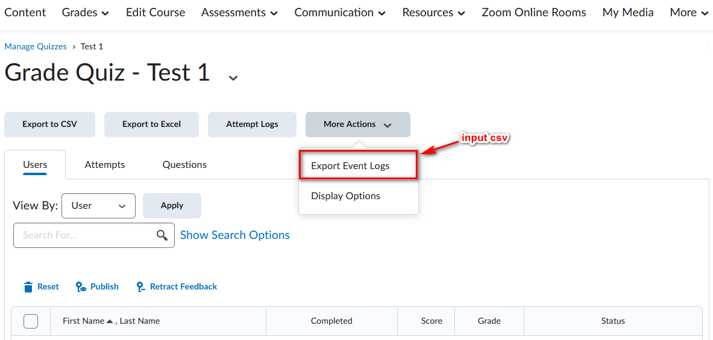
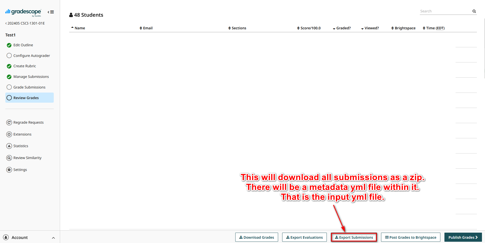

# Quiz Entry and Submission Time Checker

This script processes quiz entry times from a CSV file and compares them with submission times from a YAML file to determine if the submissions were made within a specified time limit.

## Requirements

Ensure you have the following packages installed. You can install them using the provided `requirements.txt` file:

`pandas`
`datetime`
`PyYAML`
`argparse`
`tzlocal`
`fsspec`

Install the requirements using pip:
`pip install -r requirements.txt`


## Usage

### Command Line Arguments

- `-c, --csv`: Path to the CSV file containing quiz entries.
- `-y, --yml`: Path to the YAML file containing submission times.
- `-t, --time`: Time limit in the format `HH:MM:SS` (e.g., `01:30:00` for 1 hour 30 minutes 0 seconds).

### Example Command

`python time_diff.py -c quiz_entries.csv -y submissions.yml -t 01:15:00`

If you do not provide the file paths as arguments, the script will prompt you to enter them.

### Input Files

#### CSV File (Quiz Entries)

- **Source:** 
- **Format:**
    ```
    Date,Time,User,Event
    2024-05-10,08:00:00,John Doe,Quiz Entry
    2024-05-10,08:05:00,Jane Smith,Quiz Entry

    ...
#### YAML File (Submission Times)

- **Source:** 
- **Format:**
    ```
    12345:
    :submitters:
        - :name: "John Doe"
    :created_at: "2024-05-10 09:00:00.000000Z"
    67890:
    :submitters:
        - :name: "Jane Smith"
    :created_at: "2024-05-10 09:15:00.000000Z"
    
    ...
### Output
The script generates an output.csv file with the names and time differences for entries that exceeded the specified time limit.


    Name,Time Difference
    Jane Smith,0 days 01:10:00
The script also prints the results to the console.

### Script Details

The script performs the following steps:

1. Parse command-line arguments or prompt for file paths.
2. Read the CSV file and parse the datetime information.
3. Filter the CSV data for quiz entries.
4. Load the YAML file and extract submission times.
5. Convert all times to UTC for comparison.
6. Calculate the time difference between quiz entries and submissions.
7. Save and print the results if the time difference exceeds the specified limit.

### License

This project is licensed under the MIT License. See the LICENSE file for details.
